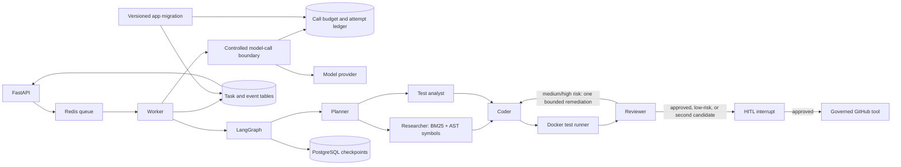

# Architecture

RepoPilot deliberately separates agentic decisions from deterministic controls.

## Trust boundaries

1. Repository URLs are limited to public GitHub HTTPS URLs plus one bundled demo URI.
2. A service-owned, versioned capability policy separates readable files from writable existing
   files and trusted creation scopes. The default keeps tests and build/CI configuration read-only,
   excludes credential-like files from context, and denies creation, deletion, and rename. Paths
   use one normalized identity for matching, deduplication, context lookup, and access; traversal,
   `.git`, case aliases, symbolic links, hard links, and special files are rejected. See
   [workspace capability policy](workspace-capabilities.md).
3. Test commands are parsed to argument arrays; shell operators and arbitrary executables are rejected.
4. Tests execute from a disposable snapshot of the current task workspace, without inheriting the
   worker's mounts, network access, Linux capabilities, or privilege escalation. Symlinks and
   special files are rejected when the snapshot is built.
5. GitHub writes require a non-empty diff, passing tests, an allowlisted owner, runtime enablement,
   a token, reviewer approval, and a LangGraph human interrupt. Deterministic checks override an
   incorrect model approval and feed their evidence into the bounded retry loop.
6. Tokens and credential-bearing URLs are never placed in graph state or task events.

The worker's Docker-socket mount is an administrative trust boundary: access to that socket is
effectively host-level Docker control. Run RepoPilot only on a trusted host; production deployments
should replace it with a remote, least-privilege sandbox service.

## Persistence and recovery

Every graph node is checkpointed by `AsyncPostgresSaver`. The stable `graph_thread_id` stored on
the task record is the recovery cursor. Approval resumes the same thread with
`Command(resume=...)`; it does not rebuild the workflow from scratch.

When deterministic validation fails, or when the reviewer reports a concrete medium/high-risk
finding, the coder refreshes repository context from the already modified workspace before
applying feedback. A low-risk or evidence-only reviewer concern goes directly to HITL; after one
review-driven remediation, the next candidate is also escalated. Previous edits remain
accumulated in state, and the configured maximum iteration count prevents an unbounded agent loop.

Redis is intentionally not the source of truth. It owns dispatch, short-lived locks,
cancellation flags, and live event fan-out. PostgreSQL owns task history, events, the model-call
ledger, and graph state. RepoPilot's Alembic revisions own task/event/call-ledger application
tables; LangGraph checkpoint tables stay behind `AsyncPostgresSaver.setup()` and are never modified
by guessed application migrations. The application migration service must complete before API or
Worker starts. Existing
deployments stop old writers first because pre-CH-09 Workers do not participate in state-version
compare-and-set. See [database migrations and task state versions](database-migrations.md).

Task records carry a monotonically increasing `state_version`. Each accepted status/result update
matches the caller's expected status and version and advances the version atomically; stale updates
are rejected. Result and event JSON carry explicit schema versions, with migrated legacy rows
reported as version `0` and current writes as version `1`. This guards the application row, but it
does not make Redis delivery, checkpoints, workspace changes, events, or remote side effects one
transaction.

Before every provider transport attempt, the Worker commits a task-wide budget reservation and
then records `STARTED`. Planner, Coder, policy corrections, Reviewer calls, and controlled retries
share this total. Completed attempts become `SUCCEEDED` or `FAILED`; an attempt that may have sent
bytes but lacks a persisted outcome becomes `UNKNOWN` on recovery and is never refunded. A
reservation left before `STARTED` also remains consumed. This conservatism closes the free-retry
window but cannot make the database and provider one transaction. See
[model-call budgets and provider failures](model-call-control.md).

`scripts/recovery_smoke.sh` exercises this contract at the human-approval checkpoint: it creates a
task, waits for the persisted interrupt, restarts the worker, submits the decision, and verifies
that the same task completes without repeating the test runner or resetting its model-call total.

## Repository retrieval

The researcher uses a deterministic hybrid retriever before any code-generation call. It combines
BM25 lexical relevance, path matches, Python AST symbols, and one-hop source/test dependencies.
Every selected file has component scores and match evidence in graph state and task results. A
hard character budget limits model context; selected file contents are included whole rather than
silently truncated, so the coder is not asked to rewrite a file from a partial body.

This is an offline, explainable retrieval baseline. It does not claim embedding search, semantic
reranking, or large-repository quality. See `docs/retrieval.md` for the evaluation contract.

## Observability

Each node records its name, iteration, and duration in graph state. The task result persists these
records, while `GET /api/v1/tasks/{task_id}/metrics` aggregates wall time, node time, node run
counts, per-node duration, iteration count, sandbox time, and separate model-call reserved,
started, succeeded, failed, unknown, pending, retry, fallback, backoff, and trusted-usage fields.
Node-update events carry the
corresponding duration so the API, SSE stream, and post-run metrics describe the same execution.
