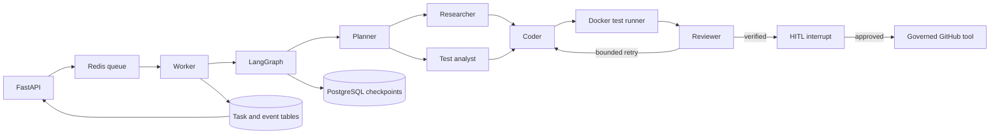

# Architecture

RepoPilot deliberately separates agentic decisions from deterministic controls.

## Trust boundaries

1. Repository URLs are limited to public GitHub HTTPS URLs plus one bundled demo URI.
2. Model-generated paths are resolved under the task workspace and may not access `.git`.
3. Test commands are parsed to argument arrays; shell operators and arbitrary executables are rejected.
4. Tests execute without network access, Linux capabilities, or privilege escalation.
5. GitHub writes require an allowlisted owner, runtime enablement, a token, reviewer approval,
   passing tests, and a LangGraph human interrupt.
6. Tokens and credential-bearing URLs are never placed in graph state or task events.

The worker's Docker-socket mount is an administrative trust boundary: access to that socket is
effectively host-level Docker control. Run RepoPilot only on a trusted host; production deployments
should replace it with a remote, least-privilege sandbox service.

## Persistence and recovery

Every graph node is checkpointed by `AsyncPostgresSaver`. The stable `graph_thread_id` stored on
the task record is the recovery cursor. Approval resumes the same thread with
`Command(resume=...)`; it does not rebuild the workflow from scratch.

When review requests another bounded iteration, the coder refreshes repository context from the
already modified workspace before applying the feedback. Previous edits remain accumulated in
state, and the configured maximum iteration count prevents an unbounded agent loop.

Redis is intentionally not the source of truth. It owns dispatch, short-lived locks,
cancellation flags, and live event fan-out. PostgreSQL owns task history, events, and graph state.

`scripts/recovery_smoke.sh` exercises this contract at the human-approval checkpoint: it creates a
task, waits for the persisted interrupt, restarts the worker, submits the decision, and verifies
that the same task completes without repeating the test runner.

## Observability

Each node records its name, iteration, and duration in graph state. The task result persists these
records, while `GET /api/v1/tasks/{task_id}/metrics` aggregates wall time, node time, node run
counts, per-node duration, iteration count, and sandbox time. Node-update events carry the
corresponding duration so the API, SSE stream, and post-run metrics describe the same execution.
